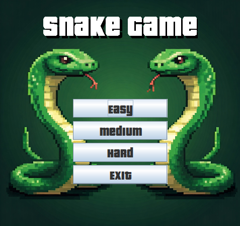
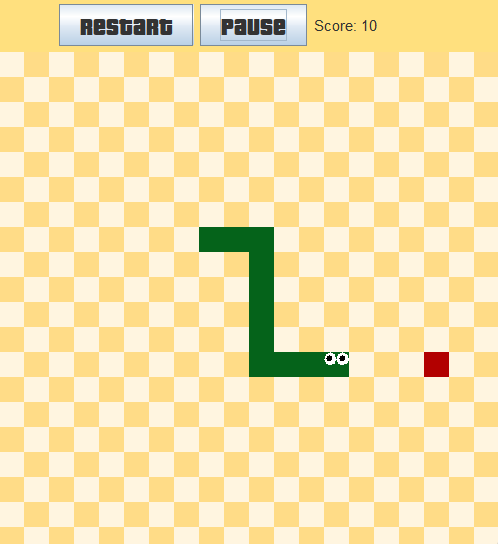
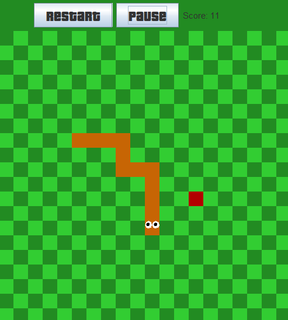
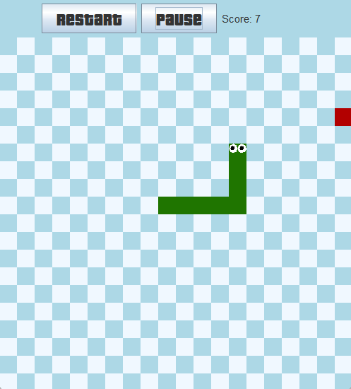

# Snake Game 🐍

<div align="center">



</div>>

## 📝 Descrição

Snake Game é um jogo simples e divertido que desafia os jogadores a controlar uma cobra que cresce a cada porção de comida consumida. O jogo oferece três modos de dificuldade: Easy, Medium e Hard, cada um com suas próprias regras.

- Modo Easy: Neste modo, a única forma de perder é colidindo com o próprio corpo da cobra. Ideal para iniciantes, permite que os jogadores se familiarizem com os controles e a mecânica do jogo.

- Modo Medium: Além da mecânica do modo Easy, neste nível de dificuldade, o jogador também perde se a cobra colidir com as paredes. Isso adiciona um desafio extra, exigindo mais atenção e estratégia.

- Modo Hard: Este modo combina as regras do modo Medium, mas com um desafio adicional: a velocidade da cobra aumenta cada vez que ela consome uma porção de comida. Os jogadores precisarão de reflexos rápidos e habilidades aprimoradas para ter sucesso nesse nível.

## 🖥️ Tecnologias Utilizadas


## 🕹️ Imagens do Jogo  

- <strong>Modo Easy (Temática Praiana) 🏖️</strong>
<div align="center">  </div>

- <strong>Modo Medium (Temática Florestal) 🌳🌳</strong>
<div align="center">  </div>

<strong>Modo Hard (Temática Gelo) ❄️</strong>
<div align="center">  </div> 

## 🎮 Como Jogar
- **Inicie o Jogo**: Execute o arquivo `SnakeGame.jar` para começar.
- **Escolha um Modo**: Selecione entre os três modos de dificuldade:
  - **Easy**: Apenas colidir com o próprio corpo faz você perder.
  - **Medium**: Você perde se colidir com as paredes.
  - **Hard**: A velocidade aumenta ao comer, e você perde se colidir com o corpo ou as paredes.
- **Controles**:
   - Use as teclas de seta **(↑, ↓, ←, →)** ou **(W, A , S ,D)** para mover a cobra.
   - Use os botões **Pause** e **Restart** na interface para controlar o jogo.

## 🎯 Objetivo do Jogo

O objetivo é controlar a cobra e coletar o máximo de comida possível, aumentando seu comprimento e evitando colisões. Quanto mais comida você coletar, maior será sua cobra e maior será o desafio!

## 🖥️ Requisitos do Sistema

- `Java 17` ou superior
- Sistema operacional: `Windows`, `macOS` ou `Linux`

## ⚙️ Como Instalar

### Clonando o Repositório

1. **Verifique se o Java está instalado**: Abra um terminal ou prompt de comando e digite `java -version`. Se o Java estiver instalado, você verá a versão instalada.
2. **Baixe o repositório**: Clone este repositório ou baixe os arquivos diretamente em seu computador.
   ```bash
   git clone https://github.com/Kaique-GM/Snake-Game-java.git
   ````
3. **Execute o jogo**: Após o download, você pode iniciar o jogo de duas maneiras:
 - **Clique no arquivo `SnakeGame.jar`**: Se o Java estiver instalado e configurado corretamente, o jogo iniciará automaticamente.
 - **Via Terminal**: Navegue até o diretório onde o arquivo está localizado e execute o seguinte comando:
    ```bash
    java -jar SnakeGame.jar
     ```

## 💬 Feedback e Contribuições

Se você encontrou um bug ou gostaria de sugerir melhorias, sinta-se à vontade para abrir uma `Issue` ou enviar um `Pull Request`. Agradeço seu feedback!
